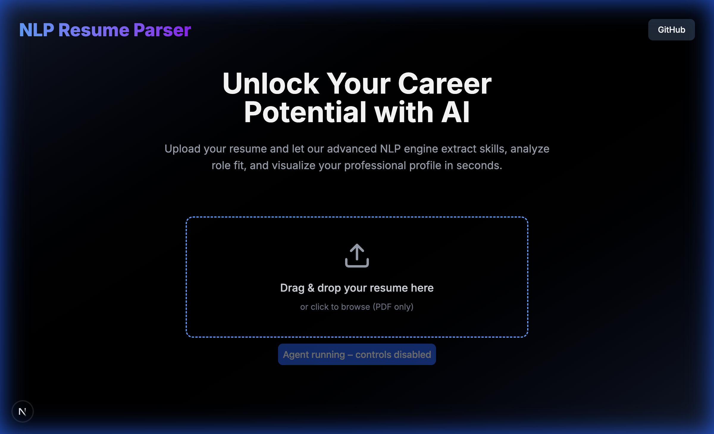

# 📄 vita — Intelligent Résumé Parser & Market Insights

A sleek, premium full-stack application that transforms raw PDF résumés into structured, actionable talent fingerprints. It doesn't just parse; it visualizes candidate capabilities and maps their fit against custom job descriptions and global market indices.

## ✨ Core Features

*   **Global Market Insights**: Interactive dashboard showcasing tech market growth rates, hiring velocity, top engineering trends, and salary indices.
*   **Job Description Matcher (ATS)**: Calculates compatibility match percentages and skill-gap analyses directly against pasted role requirements.
*   **Structured Capability DNA**: Generates a dynamic capability radar map using **Recharts** to visualize technical breadth and depth.
*   **Premium Minimalist Interface**: Styled with a dark "Champagne & Caviar" aesthetic that prioritizes visual comfort and precise spacing.

---

## 📸 Dashboard Preview



---

## 🏗️ Technical Architecture

### Frontend
- **Framework**: Next.js 16 (App Router)
- **Styling**: Tailwind CSS (v4)
- **Animations**: Framer Motion
- **Visualization**: Recharts (Radar & Line charts)

### Backend
- **Framework**: Django 5.0
- **API**: Django REST Framework (DRF)
- **NLP Engine**: spaCy (`en_core_web_sm`)
- **PDF Extraction**: PDFPlumber
- **Compatibility Analyzer**: Gemini 2.0 Flash Integration
- **Database**: SQLite3

---

## 🚀 Getting Started

### Prerequisites
- Python 3.12+
- Node.js 18+

### Installation

1. **Clone the repository**
   ```bash
   git clone https://github.com/shabbirhardwarewala/NLPResumeParser.git
   cd NLPResumeParser
   ```

2. **Backend Setup**
   ```bash
   cd backend
   python -m venv venv
   source venv/bin/activate
   pip install -r requirements.txt
   python -m spacy download en_core_web_sm
   python manage.py migrate
   python manage.py runserver
   ```

3. **Frontend Setup**
   ```bash
   cd ../frontend
   npm install
   npm run dev
   ```
